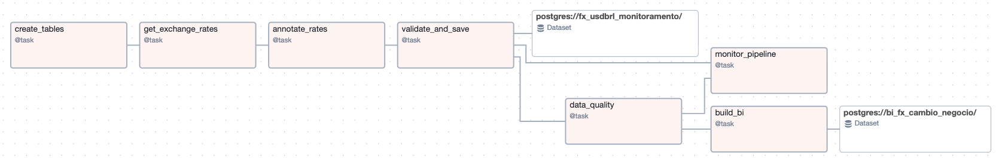
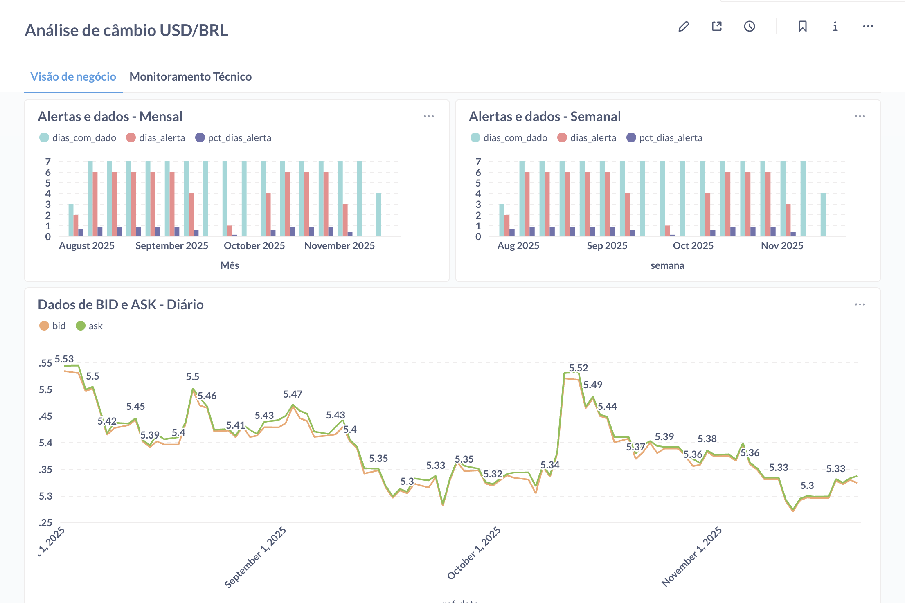
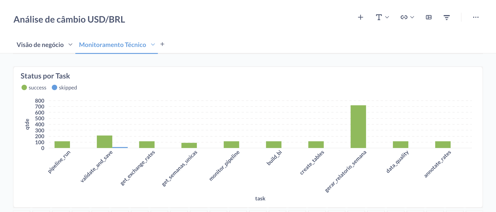

# README — Pipeline de Monitoramento de Câmbio com Airflow, DataOps, Datasets e BI Semanal

Este repositório implementa um pipeline **completo e reprodutível** usando **Apache Airflow**, **Postgres**, **DataOps**, **Datasets**, **Dynamic Task Mapping**, **Makefile**, **pytest** e **tox** para monitoramento do câmbio USD/BRL, anotação automática, validação, geração de BI semanal e relatórios agregados orientados a dados.

---

## Estrutura Geral do Projeto

```
├── .tox/
├── airflow/
│   ├── dags/
│   │   ├── monitoramento_cambio_anotacoes.py
│   │   └── fx_bi_relatorios_semanais.py
│   ├── docker-compose-airflow.yml
│   └── requirements.txt
├── docs/
│   └── airflow_graph_dag.png
├── tests/
│   └── test_dags_load.py
├── Makefile
├── tox.ini
└── README.md
```

---

## Objetivo do Pipeline

O projeto implementa um fluxo completo que inclui:

- Ingestão diária da API pública de câmbio
- Anotação automática (`alert_flag`)
- Data Quality e logging técnico
- View de BI semanal (Dataset)
- Relatórios semanais com Dynamic Task Mapping
- Orquestração orientada por dados via **Airflow Datasets**
- Execução automática de testes
- Ferramentas de automação (Makefile, tox, tasks.py)

---

## DAG 1 — `monitoramento_cambio_anotacoes`

- Executa **diariamente** com `@daily`
- Usa `catchup=True` para rodar histórico
- Etapas:

1. **create_tables**
2. **get_exchange_rates**
3. **annotate_rates**
4. **validate_and_save**  
   - Faz `UPSERT` por dia  
   - Emite `FX_MONITORAMENTO_DS`
5. **data_quality**
6. **build_bi**  
   - Cria a view semanal de BI  
   - Emite `FX_BI_SEMANAL_DS`
7. **monitor_pipeline**

---

## DAG 2 — `fx_bi_relatorios_semanais`

- **Não tem cron**
- É acionada automaticamente quando o Dataset
  ```
  FX_BI_SEMANAL_DS = Dataset("postgres://bi_fx_cambio_negocio")
  ```
  é atualizado pela DAG 1.
- Etapas:

1. `get_semanas_unicas`
2. `gerar_relatorio_semana` (Dynamic Task Mapping)

Essa DAG grava na tabela física:

```
fx_relatorios_semanais
```

Incluindo a flag exclusiva:

```
risco_semana = 1 se pct_dias_alerta > 0.5
```

---

<p align="center">
  
  <br>
  <em>Figura 1 – Fluxo da DAG principal</em>
</p>

## Estrutura das Tabelas Criadas

### `fx_usdbrl_monitoramento`
Contém dados diários da API, anotação e timestamp.

| Coluna         | Tipo      | Descrição                                                   |
|----------------|-----------|-------------------------------------------------------------|
| id             | SERIAL PK | Identificador único da linha                                |
| ref_date       | DATE      | Data de referência da cotação (única por dia)               |
| ref_timestamp  | TIMESTAMP | Timestamp retornado pela API                                |
| code           | TEXT      | Código da moeda base (USD)                                  |
| codein         | TEXT      | Código da moeda de destino (BRL)                            |
| name           | TEXT      | Nome da cotação                                             |
| bid            | NUMERIC   | Valor de compra do dólar                                    |
| ask            | NUMERIC   | Valor de venda do dólar                                     |
| pct_change     | NUMERIC   | Variação percentual                                         |
| alert_flag     | INT       | 1=alerta, 0=ok, NULL=sem dados                              |
| created_at     | TIMESTAMP | Timestamp da inserção                                       |


### `fx_dq_results`
Contém contagens de erros, nulos, validação e total de registros.

| Coluna                   | Tipo      | Descrição                                      |
|--------------------------|-----------|------------------------------------------------|
| data_execucao            | TIMESTAMP | Timestamp da execução do DQ                    |
| total_registros          | INT       | Total de linhas em fx_usdbrl_monitoramento     |
| erros_bid_nao_positivo   | INT       | Contagem de bid <= 0                           |
| erros_ask_nao_positivo   | INT       | Contagem de ask <= 0                           |
| nulos_bid                | INT       | Contagem de valores NULL em bid                |
| nulos_ask                | INT       | Contagem de valores NULL em ask                |

### `bi_fx_monitoramento_pipeline`
Tabela de log técnico do pipeline (todas as tasks logam sucesso/falha).

| Coluna         | Tipo      | Descrição                                       |
|----------------|-----------|-------------------------------------------------|
| data_execucao  | TIMESTAMP | Quando o log foi inserido                       |
| execution_date | TIMESTAMP | Logical date da DAG                             |
| task           | TEXT      | Nome da task                                    |
| status         | TEXT      | success / failed / skipped                      |
| mensagem_erro  | TEXT      | Texto do erro, se existir                       |
| nova_linha_fato| INT       | 1 se inseriu dado novo, 0 se não                |

### View `bi_fx_cambio_negocio`
Agrega por semana:

- `bid_medio_semana`
- `ask_medio_semana`
- `dias_alerta`
- `dias_com_dado`
- `pct_dias_alerta`

| Coluna             | Tipo    | Descrição                                            |
|--------------------|---------|------------------------------------------------------|
| semana             | DATE    | Primeiro dia da semana                               |
| bid_medio_semana   | NUMERIC | Média semanal de bid                                 |
| ask_medio_semana   | NUMERIC | Média semanal de ask                                 |
| dias_alerta        | INT     | Quantos dias da semana tiveram alerta                |
| dias_com_dado      | INT     | Quantidade de dias com dados                         |
| pct_dias_alerta    | NUMERIC | dias_alerta / dias_com_dado                          |

### `fx_relatorios_semanais`
Materializa o BI semanal + flag de risco.

| Coluna             | Tipo      | Descrição                                             |
|--------------------|-----------|-------------------------------------------------------|
| semana             | DATE PK   | Semana agregada                                       |
| bid_medio_semana   | NUMERIC   | Média semanal do bid                                  |
| ask_medio_semana   | NUMERIC   | Média semanal do ask                                  |
| dias_alerta        | INT       | Total de dias com alerta                              |
| dias_com_dado      | INT       | Total de dias com informações                         |
| pct_dias_alerta    | NUMERIC   | Proporção de dias com alerta                          |
| risco_semana       | INT       | 1 se pct_dias_alerta > 0.5, senão 0                   |
| created_at         | TIMESTAMP | Timestamp do relatório                                |


---

## Testes com pytest

Arquivo:

```
tests/test_dags.py
```

Conteúdo:

```
from airflow.models import DagBag

def test_dags_import():
    dag_bag = DagBag(dag_folder="dags", include_examples=False)
    assert len(dag_bag.import_errors) == 0

def test_monitoramento_dag_exists():
    dag_bag = DagBag(dag_folder="dags", include_examples=False)
    assert "monitoramento_cambio_anotacoes" in dag_bag.dags
    assert "fx_bi_relatorios_semanais" in dag_bag.dags
```

## Tox — Ambiente Isolado para Testes

Arquivo `tox.ini`:

```
[tox]
envlist = py

[testenv]
deps =
    pytest
    -r airflow/requirements.txt
commands =
    pytest tests/
```

### Rodar:

```
tox
```

---

## Makefile — Automação de Comandos

Arquivo `Makefile`:

```
backfill-desde:
	@if [ -z "$(DESDE)" ]; then 		echo "Uso: make backfill-desde DESDE=2025-11-01"; exit 1; 	fi; 	END=$$(date +"%Y-%m-%d"); 	docker compose -f airflow/docker-compose.yaml exec airflow-webserver 		airflow dags backfill monitoramento_cambio_anotacoes -s $(DESDE) -e $$END

run-tests:
	pytest -q

up:
	docker compose -f airflow/docker-compose.yaml up -d

down:
	docker compose -f airflow/docker-compose.yaml down
```

### Rodar backfill:

```
make backfill-desde DESDE=2025-11-01
```

---

## Como Validar a Execução Ponta a Ponta

### 1. Rodar Airflow

```
make up
```
### 2. Rodar conexão Postgres

```
make create-conn-postgres
```

### 3. Ativar DAGs no UI

- `monitoramento_cambio_anotacoes` → **unpaused** PRINCIPAL
- `fx_bi_relatorios_semanais` → **unpaused**

### 4. Rodar a DAG principal

Isso vai:
- puxar o câmbio
- anotar
- validar
- registrar DQ
- emitir Dataset
- gerar BI
- disparar a DAG 2 automaticamente

### 5. Validar tabelas no Postgres:

```
SELECT * FROM fx_usdbrl_monitoramento;
SELECT * FROM fx_dq_results;
SELECT * FROM bi_fx_cambio_negocio;
SELECT * FROM fx_relatorios_semanais;
SELECT * FROM bi_fx_monitoramento_pipeline;
```

---

## Como o Metabase se Atualiza Automaticamente

A view `bi_fx_cambio_negocio` é recriada **toda vez** que a DAG 1 roda.

O Metabase, ao acessar a view, sempre lerá:

- dados atualizados a partir de Agosto/25
- últimas semanas
- percentuais de alerta já processados

A tabela `fx_relatorios_semanais` também é atualizada pela DAG 2 sempre que o Dataset muda.

---

<p align="center">
  
  <br>
  <em>Figura 2 – Visão de negócio no Metabase</em>
</p>

<p align="center">
  
  <br>
  <em>Monitoramento técnico no Metabase</em>
</p>

## Conclusão

Este projeto demonstra:

- DataOps aplicado
- Datasets para orquestração data-driven
- Pipeline diário idempotente
- BI automático semanal
- Dynamic Task Mapping
- Makefile + tox + invoke para automação completa
- Testes automatizados
- Logging técnico e monitoramento real

---

