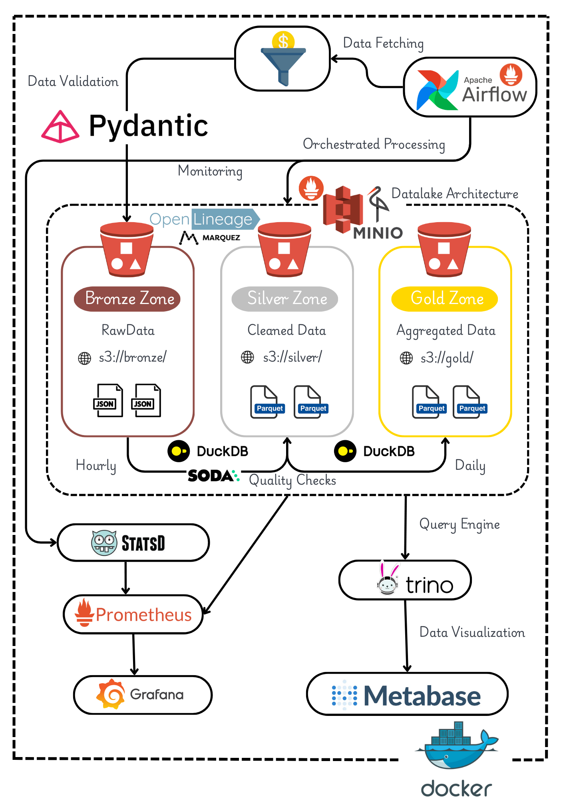
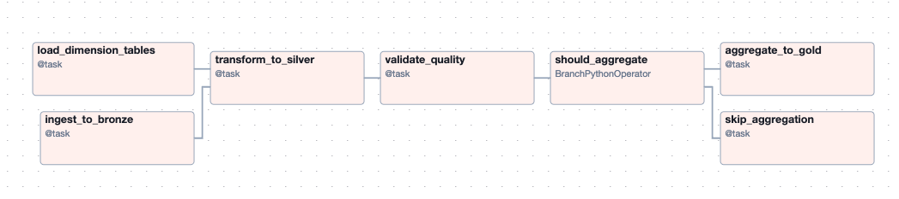
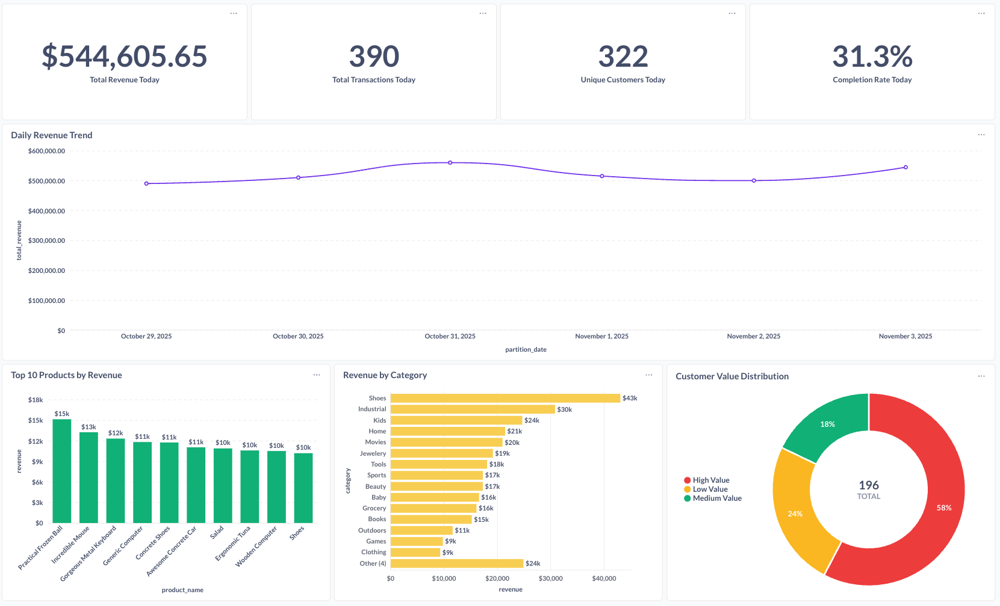
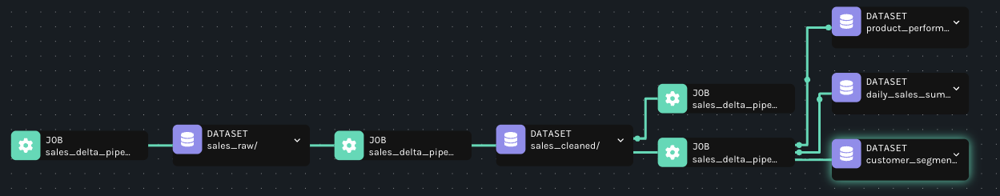
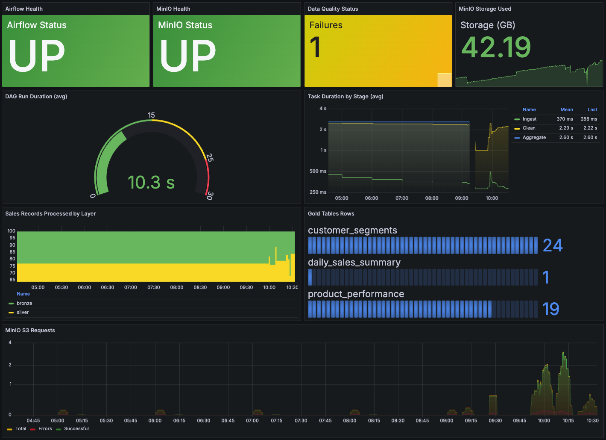

# **Batch Data Pipeline with Airflow, DuckDB, Delta Lake, Trino and Metabase**

> Este diretório é um clone adaptado do repositório original https://github.com/abeltavares/batch-data-pipeline, agora versionado diretamente neste projeto (sem submódulo) para facilitar o uso nas aulas.

     

---

## **📖 Overview**
This project demonstrates a **batch data pipeline** following the **Medallion Architecture** (Bronze → Silver → Gold). It showcases how to ingest, clean, validate, aggregate, and visualize sales data using modern data engineering tools, all containerized with Docker for easy deployment.

🔎 **Technologies Used:**

- **Orchestration:** [Apache Airflow](https://airflow.apache.org/)
- **Data Processing:** [DuckDB](https://duckdb.org/)
- **Data Lake Format:** [Delta Lake](https://delta.io/)
- **Object Storage:** [MinIO (S3-compatible)](https://min.io/)
- **Query Engine:** [Trino](https://trino.io/)
- **Visualization:** [Metabase](https://www.metabase.com/)
- **Data Quality:** [Soda Core](https://www.soda.io/)
- **Lineage:** [OpenLineage](https://openlineage.io/) + [Marquez](https://marquezproject.ai/)
- **Observability:** [Prometheus](https://prometheus.io/) + [Grafana](https://grafana.com/)

This pipeline is perfect for **data engineers** and **students** interested in learning how to design batch data systems with data quality, observability, and lineage tracking.

---

## **🏗️ Architecture**



### **Data Flow:**

1. **Data Generator** simulates realistic sales transactions with intentional data quality issues (~20% dirty data)
2. **Bronze Layer** ingests raw JSON data to MinIO without validation
3. **Silver Layer** cleans, validates, and deduplicates data into Delta Lake tables
4. **Quality Checks** validates Silver data using Soda Core with 15+ checks
5. **Gold Layer** creates business aggregations (daily sales, product performance, customer segments)
6. **Trino** provides SQL interface for querying Delta Lake tables
7. **Metabase** visualizes business metrics through interactive dashboards
8. **Marquez** tracks data lineage across the entire pipeline
9. **Grafana** monitors pipeline health and performance metrics

---

## **🛠️ Tech Stack**

| **Component**         | **Technology**                                                              | **Purpose**                                         |
|-----------------------|-----------------------------------------------------------------------------|-----------------------------------------------------|
| **Orchestration**     | [Apache Airflow](https://airflow.apache.org/)                       | DAG scheduling and task management                  |
| **Data Processing**   | [DuckDB](https://duckdb.org/)                                       | Fast analytical processing in-memory                |
| **Data Lake Format**  | [Delta Lake](https://delta.io/)                                            | ACID transactions, time travel, schema evolution    |
| **Object Storage**    | [MinIO](https://min.io/)                                                   | S3-compatible storage for Bronze/Silver/Gold layers |
| **Query Engine**      | [Trino](https://trino.io/)                                                 | Distributed SQL querying on Delta Lake             |
| **Visualization**     | [Metabase](https://www.metabase.com/)                                      | Interactive dashboards and BI                       |
| **Data Quality**      | [Soda Core](https://www.soda.io/)                                          | Data validation and quality checks                  |
| **Data Lineage**      | [Marquez](https://marquezproject.ai/) + [OpenLineage](https://openlineage.io/) | End-to-end data lineage tracking            |
| **Observability**     | [Prometheus](https://prometheus.io/) + [Grafana](https://grafana.com/)    | Metrics collection and visualization                |
| **Data Generation**   | [Faker](https://faker.readthedocs.io/) + [Faker Commerce](https://pypi.org/project/faker-commerce/) | Realistic sales data simulation |

---

## **📦 Project Structure**

```bash
duckmesh-sales/
├── airflow/
│   └── dags/
│       └── sales_pipeline.py          # Main Airflow DAG
├── config/
│   └── pipeline_config.yaml           # Pipeline configuration
├── docker/
│   ├── airflow/                       # Airflow Docker setup
│   ├── grafana/                       # Grafana dashboards & datasources
│   ├── marquez/                       # Marquez lineage configuration
│   ├── metabase/                      # Metabase setup scripts
│   ├── prometheus/                    # Prometheus configuration
│   ├── statsd/                        # StatsD metrics mapping
│   └── trino/                         # Trino catalog configuration
├── docker-compose.yml                 # Docker services orchestration
├── soda/
│   └── checks.yml                     # Soda Core quality checks
└── src/
    ├── config.py                      # Configuration management
    ├── generators/
    │   └── sales_generator.py         # Synthetic data generator
    ├── models/
    │   └── schemas.py                 # Pydantic validation schemas
    ├── processors/
    │   ├── base_processor.py          # Abstract base class
    │   ├── bronze_processor.py        # Raw data ingestion
    │   ├── silver_processor.py        # Data cleaning & deduplication
    │   ├── gold_processor.py          # Business aggregations
    │   └── quality_checker.py         # Data quality validation
    └── utils/
        ├── database.py                # DuckDB connection manager
        ├── logger.py                  # Logging configuration
        ├── metrics.py                 # Custom Prometheus metrics
        └── storage.py                 # MinIO/S3 client
```

---

## **🔧 Setup Instructions**

### **1. Prerequisites**

- **Docker** and **Docker Compose** installed
- Minimum **8GB RAM** recommended
- **Git** for cloning the repository

### **2. Clone the Repository**

```bash
git clone https://github.com/abeltavares/batch-data-pipeline.git
cd batch-data-pipeline
```

### **3. Start All Services**

```bash
docker-compose up -d
```

⚠️ **Note:** First startup takes 3-5 minutes to initialize all services. All components are containerized using Docker for easy deployment.

### **4. Access the Services**

| **Service**               | **URL**                          | **Credentials**          |
|---------------------------|----------------------------------|--------------------------|
| **Airflow UI**            | `http://localhost:8080`          | `admin` / `admin`        |
| **Metabase**              | `http://localhost:3000`          | `admin@duckmesh.com` / `DuckMesh2025!` |
| **Grafana**               | `http://localhost:3001`          | `admin` / `admin`        |
| **MinIO Console**         | `http://localhost:9001`          | `minioadmin` / `minioadmin` |
| **Trino UI**              | `http://localhost:8081/ui`       | *No Auth*                |
| **Marquez (Lineage)**     | `http://localhost:3002`          | *No Auth*                |
| **Prometheus**            | `http://localhost:9090`          | *No Auth*                |

---

## **📥 Data Generation & Ingestion**

### **1. Sales Data Simulation**

The pipeline generates realistic sales transactions using **Faker** library with the following schema:

```python
{
  "transaction_id": "uuid",
  "customer_id": int,
  "product_id": int,
  "quantity": int,
  "unit_price": float,
  "total_amount": float,
  "transaction_timestamp": "ISO 8601",
  "payment_method": "credit_card | debit_card | cash | digital_wallet",
  "store_id": int,
  "status": "completed | pending | cancelled"
}
```

**Data Quality Issues Injected:**
- ~20% of records contain intentional issues (null values, future dates, negative amounts, mismatched totals, etc.)
- Realistic simulation of real-world data quality problems

### **2. Dimension Tables**

- **Products** (50 items): Generated with faker-commerce
- **Customers** (1,000 users): Includes demographics and segments

### **3. Pipeline Execution**

The Airflow DAG runs **hourly** by default and processes:
- 100 sales transactions per run
- Incremental loading to Bronze layer
- Automatic dimension loading (idempotent)



---

## **🔄 Data Processing Pipeline**

### **Bronze Layer: Raw Data Ingestion**

- **Purpose:** Store raw data as-is without validation
- **Format:** JSON files in MinIO (s3://bronze/)
- **Strategy:** Accept dirty data for downstream cleaning
- **Idempotency:** Timestamped files prevent overwrites

```python
# Bronze processor accepts all data
processor = BronzeProcessor()
result = processor.process()
# Output: {"key": "sales/sales_20250101_120000.json", "count": 100}
```

### **Silver Layer: Data Cleaning & Deduplication**

- **Purpose:** Clean and validate data with business rules
- **Format:** Delta Lake tables with partitioning
- **Processing:** DuckDB for fast transformations
- **Quality Rules:**
  - Remove null required fields
  - Filter future timestamps
  - Validate payment methods & statuses
  - Check amount calculations
  - Deduplicate by transaction_id

```python
# Silver processor cleans and deduplicates
processor = SilverProcessor()
result = processor.process(bronze_key="sales/sales_20250101_120000.json")
# Output: {
#   "records_read": 100,
#   "records_cleaned": 80,
#   "records_written": 75,
#   "duplicates_removed": 5
# }
```

### **Gold Layer: Business Aggregations**

Gold layer creates three business-critical tables using **parallel processing** (ThreadPoolExecutor):

#### **1. Daily Sales Summary**
```sql
SELECT
    partition_date,
    COUNT(DISTINCT transaction_id) as total_transactions,
    COUNT(DISTINCT customer_id) as unique_customers,
    SUM(total_amount) as total_revenue,
    AVG(total_amount) as avg_transaction_value,
    SUM(quantity) as total_items_sold,
    completion_rate
FROM silver.sales
GROUP BY partition_date
```

#### **2. Product Performance**
```sql
SELECT
    product_id,
    product_name,
    category,
    SUM(quantity) as units_sold,
    SUM(total_amount) as revenue,
    AVG(unit_price) as avg_selling_price
FROM silver.sales
JOIN bronze.products USING (product_id)
WHERE status = 'completed'
GROUP BY product_id, product_name, category
```

#### **3. Customer Segments**
```sql
SELECT
    customer_id,
    customer_segment,
    COUNT(transaction_id) as purchase_count,
    SUM(total_amount) as total_spend,
    CASE
        WHEN SUM(total_amount) > 1000 THEN 'High Value'
        WHEN SUM(total_amount) > 500 THEN 'Medium Value'
        ELSE 'Low Value'
    END as value_tier
FROM silver.sales
JOIN bronze.customers USING (customer_id)
GROUP BY customer_id, customer_segment
```

**Parallel Processing:**
- All three aggregations run concurrently
- ThreadPoolExecutor with 3 workers

---

## **✅ Data Quality Validation**

### **Soda Core Checks (15+ Rules)**

The pipeline validates Silver data with comprehensive checks:

```yaml
checks for sales_silver:
  # Volume checks
  - row_count > 0
  - row_count < 10000
  
  # Completeness
  - missing_count(transaction_id) = 0
  - missing_count(customer_id) = 0
  
  # Business rules
  - failed rows: quantity <= 0
  - failed rows: total_amount <= 0
  - failed rows: total != quantity * unit_price
  
  # Validity
  - duplicate_count(transaction_id) = 0
  - valid payment_method values
  - valid status values
  
  # Freshness
  - freshness(transaction_timestamp) < 2h
  
  # Statistical
  - avg(total_amount) between 50 and 2000
  - max(total_amount) < 5000
```

**Quality Check Results:**
- Tracked in Prometheus metrics
- Visualized in Grafana dashboard
- Logged in Airflow task logs

---

## **🔍 Query Data with Trino**

### **1. Run Trino CLI**

```bash
docker-compose exec trino trino --server https://localhost:8081
```

### **2. Connect to Delta Lake Catalog**

```sql
USE delta.analytics;
SHOW TABLES;
```

### **3. Query Examples**

```sql
-- Daily revenue trend
SELECT 
    partition_date,
    total_revenue,
    total_transactions
FROM daily_sales_summary
ORDER BY partition_date DESC
LIMIT 7;

-- Top selling products
SELECT 
    product_name,
    category,
    revenue,
    units_sold
FROM product_performance
WHERE data_date = CAST(CURRENT_DATE AS VARCHAR)
ORDER BY revenue DESC
LIMIT 10;

-- Customer value distribution
SELECT 
    value_tier,
    COUNT(*) as customer_count,
    AVG(total_spend) as avg_spend
FROM customer_segments
WHERE data_date = CAST(CURRENT_DATE AS VARCHAR)
GROUP BY value_tier;

-- Join across layers
SELECT 
    p.category,
    SUM(s.total_revenue) as category_revenue
FROM delta.analytics.product_performance p
JOIN delta.analytics.daily_sales_summary s
    ON p.data_date = s.partition_date
GROUP BY p.category
ORDER BY category_revenue DESC;
```

---

## **📊 Data Visualization with Metabase**

### **1. Access Metabase**

Navigate to: `http://localhost:3000`

**Credentials:**
- Email: `admin@duckmesh.com`
- Password: `DuckMesh2025!`

### **2. Pre-configured Dashboard**

The setup script automatically creates a **Sales Performance Dashboard** with:

#### **KPI Cards:**
- Total Revenue Today
- Total Transactions Today
- Unique Customers Today
- Completion Rate Today

#### **Visualizations:**
- Daily Revenue Trend (Line Chart)
- Top 10 Products by Revenue (Bar Chart)
- Revenue by Category (Horizontal Bar)
- Customer Value Distribution (Pie Chart)



### **3. Custom Queries**

Create new questions using SQL:

```sql
-- Weekly sales trend
SELECT 
    DATE_TRUNC('week', CAST(partition_date AS DATE)) as week,
    SUM(total_revenue) as weekly_revenue
FROM daily_sales_summary
GROUP BY week
ORDER BY week DESC
LIMIT 12;

-- Product category performance
SELECT 
    category,
    COUNT(DISTINCT product_id) as product_count,
    SUM(revenue) as total_revenue,
    AVG(revenue) as avg_product_revenue
FROM product_performance
WHERE data_date >= CURRENT_DATE - INTERVAL '30' DAY
GROUP BY category;
```

---

## **📈 Data Lineage with Marquez**

### **1. Access Marquez UI**

Navigate to: `http://localhost:3002`

### **2. View Pipeline Lineage**

- **Namespace:** `duckmesh-sales`
- **DAG:** `sales_delta_pipeline`

Marquez automatically tracks:
- Dataset inputs/outputs for each task
- Transformations across Bronze → Silver → Gold
- Column-level lineage (when available)
- Run history and timing



### **3. Lineage Features**

**Tracked Entities:**
- Datasets: Bronze files, Silver tables, Gold aggregations
- Jobs: Airflow tasks
- Runs: Execution history with success/failure status

**Benefits:**
- Impact analysis (what breaks if I change X?)
- Root cause analysis (where did bad data come from?)
- Compliance & auditing

---

## **🔭 Observability with Prometheus & Grafana**

### **1. Access Grafana**

Navigate to: `http://localhost:3001`

**Credentials:**
- Username: `admin`
- Password: `admin`

### **2. Pre-configured Dashboard**

**Sales Pipeline Observability** dashboard includes:

#### **Health Metrics:**
- Airflow Status
- MinIO Health
- Data Quality Status
- Storage Usage

#### **Performance Metrics:**
- DAG Run Duration
- Task Duration by Stage
- Records Processed by Layer
- Gold Table Row Counts

#### **Resource Metrics:**
- MinIO S3 Requests (successful vs errors)
- Memory Usage
- CPU Utilization



### **3. Custom Metrics**

The pipeline pushes custom metrics to Prometheus:

```python
# Records processed
pipeline_records_processed_total{layer="silver", table="sales"} 75

# Data quality failures
pipeline_data_quality_failures_total{check_name="No negative amounts"} 0

# Table sizes
pipeline_delta_table_rows{table_name="daily_sales_summary"} 30
```

### **4. Prometheus Queries**

```promql
# Average processing time per layer
rate(airflow_task_duration_sum[1h]) / rate(airflow_task_duration_count[1h])

# Success rate
100 * (
    sum(rate(airflow_dagrun_success_total[1h]))
    /
    sum(rate(airflow_dagrun_duration_count[1h]))
)

# Records processed per hour
rate(pipeline_records_processed_total[1h])
```

---

## **🏆 Key Features**

### **✅ Medallion Architecture**
- Bronze → Silver → Gold layers
- Progressive data quality improvement
- Clear separation of concerns

### **✅ Data Quality First**
- 15+ Soda Core validation rules
- Automatic dirty data generation for testing
- Quality metrics in Grafana

### **✅ ACID Transactions**
- Delta Lake for Silver/Gold layers
- Time travel support
- Schema evolution

### **✅ Idempotent Operations**
- Safe to re-run any task
- Deduplication in Silver layer
- Upsert operations in Gold layer

### **✅ Parallel Processing**
- Gold aggregations run concurrently
- ThreadPoolExecutor with 3 workers

### **✅ Full Observability**
- Custom Prometheus metrics
- Grafana dashboards
- Data lineage with Marquez
- OpenLineage integration

### **✅ Best Practices**
- Error handling & retries
- Comprehensive logging
- Health checks for services
- Docker containerization

---

## **🔧 Configuration**

### **Pipeline Configuration** (`config/pipeline_config.yaml`)

```yaml
pipeline:
  name: "sales_delta_pipeline"
  schedule: "@hourly"              # Cron schedule
  start_date: "2025-01-01"
  retries: 1

data_generation:
  sales_records_per_run: 100       # Records per DAG run
  num_products: 50
  num_customers: 1000
  num_stores: 20

aggregation:
  trigger_hour: 0                  # UTC hour for Gold aggregation

data_quality:
  enabled: true
  checks_path: "/opt/airflow/soda/checks.yml"
  fail_on_error: false             # Continue on quality failures

storage:
  bronze_bucket: "bronze"
  silver_bucket: "silver"
  gold_bucket: "gold"

observability:
  metrics_enabled: true
  job_name: "sales_pipeline"
  prometheus_pushgateway: "prometheus-pushgateway:9091"
  log_level: "INFO"
  fail_on_error: false
```

---

## **🔧 Delta Lake Configuration**

Delta Lake is used as the storage format for the Silver and Gold layers, providing ACID transactions, schema enforcement, and time travel capabilities. Below are the key configuration details:

- **Storage Paths:**
  - Silver Layer: `s3://silver/`
  - Gold Layer: `s3://gold/`
- **Partitioning:**
  - Both Silver and Gold layers are partitioned by date for efficient querying.
- **Schema Evolution:**
  - Delta Lake automatically handles schema changes, ensuring compatibility with evolving data structures.
- **Time Travel:**
  - Enables querying historical data by specifying a timestamp or version.

Delta Lake tables are registered in Trino for querying, and the metadata is managed automatically during the pipeline execution.

---

## **🔄 Airflow DAG Details**

The Airflow DAG orchestrates the entire pipeline, ensuring data flows through the Bronze, Silver, and Gold layers. Below are the key tasks and their dependencies:

- **Tasks:**
  1. **Generate Sales Data:** Simulates sales transactions and stores them in the Bronze layer.
  2. **Ingest to Bronze:** Moves raw JSON data to the Bronze layer in MinIO.
  3. **Process to Silver:** Cleans and deduplicates data, storing it in Delta Lake's Silver layer.
  4. **Validate Silver Data:** Runs Soda Core checks to ensure data quality.
  5. **Aggregate to Gold:** Creates business-critical tables (e.g., `daily_sales_summary`, `product_performance`, `customer_segments`) in the Gold layer.

- **Dependencies:**
  - The `Process to Silver` task depends on the successful completion of `Ingest to Bronze`.
  - The `Validate Silver Data` task must complete before `Aggregate to Gold` begins.

The DAG is scheduled to run hourly, ensuring timely updates to the data pipeline. Each task is idempotent, allowing safe re-runs in case of failures.

---

## **🐛 Troubleshooting**

### **Issue: Services not starting**

```bash
# Check service status
docker-compose ps

# View logs
docker-compose logs -f [service_name]

# Restart all services
docker-compose down && docker-compose up -d
```

### **Issue: Airflow DAG not appearing**

```bash
# Check Airflow logs
docker-compose logs -f airflow-scheduler

# Verify DAG file
docker exec -it airflow-scheduler ls -la /opt/airflow/dags/

# Test DAG
docker exec -it airflow-scheduler airflow dags test sales_delta_pipeline 2025-01-01
```

### **Issue: Trino can't query tables**

```bash
# Check if Delta tables exist in MinIO
docker exec -it mc mc ls -r minio/gold/

# Wait for Gold aggregation to run (check current hour)
# Or manually trigger:
docker exec -it airflow-scheduler \
  airflow tasks test sales_delta_pipeline aggregate_to_gold 2025-01-01

# Re-register tables in Trino
docker-compose restart trino-init
```

### **Issue: Metabase connection failed**

```bash
# Check Trino health
curl http://localhost:8081/v1/info

# Re-run Metabase setup
docker-compose restart metabase-setup
docker-compose logs -f metabase-setup
```

---

## **📎 Quick Reference Commands**

| **Component**           | **Command**                                                              |
|-------------------------|--------------------------------------------------------------------------|
| **Start Services**      | `docker-compose up -d`                                                   |
| **Stop Services**       | `docker-compose down`                                                    |
| **View Logs**           | `docker-compose logs -f [service]`                                       |
| **Rebuild**             | `docker-compose up --build --force-recreate -d`                          |
| **Trigger DAG**         | `docker exec -it airflow-scheduler airflow dags trigger sales_delta_pipeline` |
| **List Buckets**        | `docker exec -it mc mc ls minio/`                                        |
| **Query Trino**         | `docker-compose exec trino trino`                                        |
| **View Metrics**        | `curl http://localhost:9102/metrics`                                     |
| **Check Health**        | `docker-compose ps`                                                      |

---

## **🚀 Future**

- [ ] Implement CDC (Change Data Capture) for dimension tables
- [ ] Add alerting with Slack for pipeline failures
- [ ] Create maintenance DAG for VACUUM and OPTIMIZE on Gold tables
- [ ] Add data cataloging 
- [ ] Introduce machine learning features (churn prediction, demand forecasting)
- [ ] Implement incremental materialized views in Gold layer

---

## **🤝 Contributing**

Contributions are welcome! Please feel free to submit issues or pull requests.

**Development Setup:**
1. Fork the repository
2. Create a feature branch (`git checkout -b feature/amazing-feature`)
3. Make your changes
4. Run tests (when available)
5. Commit changes (`git commit -m 'add awesome feature'`)
6. Push to branch (`git push origin feature/awesome-feature`)
7. Open a Pull Request

---

## **📜 License**

This project is licensed under the [MIT License](LICENSE).

---

## **🙌 Acknowledgments**

- **Apache Airflow** team for the orchestration framework
- **DuckDB** team for the blazing-fast analytical database
- **Delta Lake** team for ACID transactions on data lakes
- **Trino** community for the distributed query engine
- **Metabase** team for the beautiful BI tool
- **Soda** team for data quality checks
- **Marquez** team for lineage tracking
- All open-source contributors

---

## **📞 Contact & Support**

- **GitHub Issues:** [Report bugs or request features](https://github.com/abeltavares/batch-data-pipeline/issues)
- **Email:** abelst9@gmail.com

---

### **⭐ If you found this helpful, please give it a star!**
