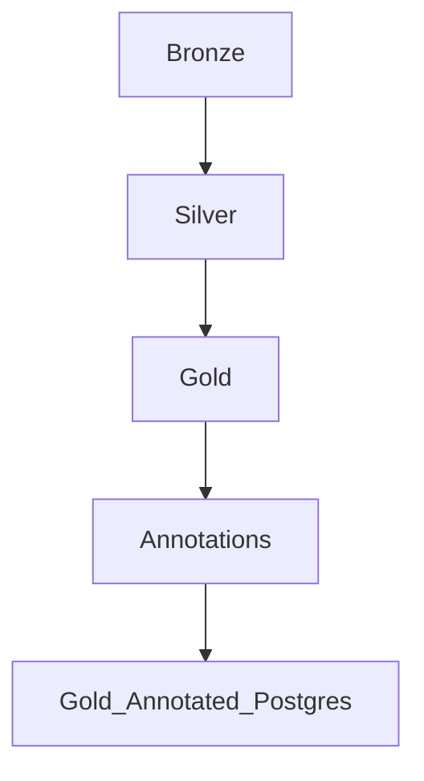

# Data Pipeline Bank Marketing – Airflow, Label Studio & Streamlit

Este projeto implementa uma pipeline completa de dados para o *Bank Marketing Dataset*, utilizando **Apache Airflow**, **MinIO**, **Label Studio**, **Great Expectations**, **Streamlit** e **PostgreSQL**.

---

## 🚀 Stack Utilizada

- **Apache Airflow (2.10.3)** — Orquestração das DAGs (Bronze → Silver → Gold)
- **MinIO** — Armazenamento dos arquivos Parquet
- **PostgreSQL** — Data Warehouse e anotação final (gold_annotated)
- **Label Studio** — Anotação manual das campanhas
- **Streamlit** — Dashboard interativo
- **Great Expectations (0.18.16)** — Validações de Data Quality na DAG Gold
- **UV** — Gerenciamento rápido de Python environment
- **Docker Compose** — Contêineres integrados

---

## 📦 Setup do Projeto

### 1️⃣ Criar ambiente com **UV**

```bash
uv venv
uv pip install -r requirements.txt
```

---

## 🔗 Configurar Connections no Airflow

### 🛢️ PostgreSQL Connection  
| Campo | Valor |
|-------|-------|
| Conn Id | `postgres_airflow` |
| Conn Type | `Postgres` |
| Host | `postgres` |
| Login | `airflow` |
| Password | `airflow` |
| Port | `5432` |
| Schema / Database | `airflow` |

---

### 📝 Label Studio Connection  
| Campo | Valor |
|-------|-------|
| Conn Id | `label_studio` |
| Conn Type | `HTTP` |
| Host | `http://label-studio:8080` |
| Extra | `{"api_key": "SUA_CHAVE_AQUI"}` |

| Observação: A chave da API você obtém diretamente no Label Studio.

---

## ⚙️ Fluxo das DAGs



---

### 🥉 BRONZE (dag_bronze)

- Recebe o CSV original
- Normaliza colunas
- Salva no MinIO e local
- Dispara a DAG Silver

---

### 🥈 SILVER (dag_silver)

- Converte CSV → Parquet
- Padroniza tipos e valores
- Categoriza a educação
- Salva local e MinIO
- Trigger DAG Gold

---

### 🥇 GOLD (dag_gold)

- Carrega parquet da Silver
- Feature Engineering
- Cria `annotation_auto`
- Realiza validações com **Great Expectations**
- Salva Gold no MinIO

---

### ✍️ ANOTAÇÕES (dag_annotations)

- Envia amostras do Gold para o Label Studio
- Label Studio retorna `annotation` manual

---

### 🗃️ GOLD → POSTGRES

- DAG: `gold_annotated_to_postgres`
- Lê parquet anotado
- Insere na tabela `gold_annotated` (PostgreSQL)

---

## 📊 Dashboard Streamlit

- Conecta ao PostgreSQL
- Mostra Distribuição das Anotações
- Exibe tabela bruta (Gold + Anotações)

---

## 🧪 Great Expectations

Implementado somente na DAG **Gold**, antes da geração final:

Validações aplicadas:
- `idade` entre 18 e 100
- `num_contatos_campanha >= 0`
- `faixa_duracao_contato` dentro de categorias
- `intensidade_contato` válida
- `eficiencia_campanha` entre 0 e 1

---

## 🏁 Como Executar

1️⃣ Iniciar containers  
```bash
docker-compose up --build
```

2️⃣ Acessar o Airflow  
👉 http://localhost:8080  
Login: `admin` / `admin`

3️⃣ Rodar as DAGs na ordem:
```
bronze → silver → gold → annotations → gold_annotated_to_postgres
```

4️⃣ Acessar Label Studio  
👉 http://localhost:8089

5️⃣ Dashboard  
👉 http://localhost:8501

---

## ✨ Resultado Final

🗂️ Tabela final no PostgreSQL: `gold_annotated`  
📈 Dashboard de insights via Streamlit  
🛠️ Pipeline validado com Great Expectations  
✍️ Anotações humanas integradas

---
