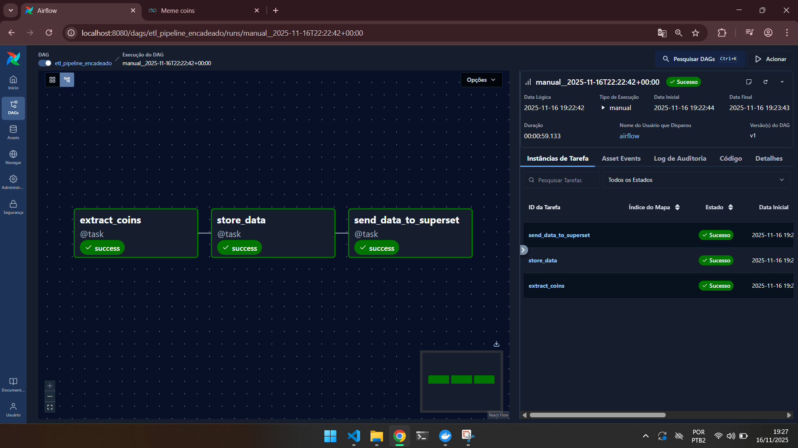
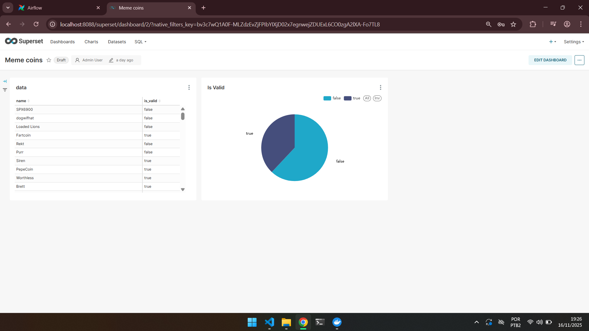

# Trabalho Dataops

## Sobre

O trabalho foi feito utilizando airflow para orquestração, duckbd para armazenamento e superset para visualização. 

A pipeline possui 3 etapas. Ingestão/transformação, armazenamento e visualização. 

A primeira coleta as informações sobre *meme coins* do site *coingecko*, a segunda armazena os dados em tabelas em uma instancia local do duckdb e a terceira atualiza um dataset pré criado no *superset*, o que automaticamente atualiza os dados disponíveis no dashboard.

Os dados são anotados aleatóriamente durante a etapa 2 com uma flag *is_valid* que pode ser vista através do dashboard no fim do processo.

A escolha do superset se deu por ser uma opção plug and play e com uma integração simplificada através de APIs.

A perfeita executação depende de um dataset e um dashboard pré criados no superset, por isso um banco já se encontra disponível em /superset_home.

## Requisitos

Você precisa de docker e Python 3.13.9 instalados na máquina para rodar a pipeline. Além disso as etapas a seguir foram feitas no windows. Outros sistemas podem precisar de pequenas mudanças nos comandos.


## Setup do ambiente

O setup do ambiente consiste apenas em criar um ambiente virtual python e instalar as dependencias

1. Crie um venv com o comando ```python -m venv venv```;

2. Ative o ambiente com ```.\venv\Scripts\activate ```;

3. Instale as dependencias com ```pip install -r .\requirements.txt```

## Executando

Executá-lo é simples, todas as ações estão automatizadas através do airflow:

1. Builde as imagens com ```docker compose build```

2. Suba o ambiente com ```docker compose up```;

3. vá até http://localhost:8080/ e faça login com usuário *airflow* e senha *airflow*;

4. vá até a dag etl_pipeline_encadeado e execute-a;

5. observe as etapas avançarem e leia os logs para mais detalhes;

6. quando a pipeline finalizar os dados estarão salvos na pasta /data;

7. vá até http://localhost:8088/ e faça login com usuário admin e senha admin;

8. vá em *dashboards* e acesse o dashboard disponivel;

9. observe as informações atualizadas com a última execução.

## Imagens



